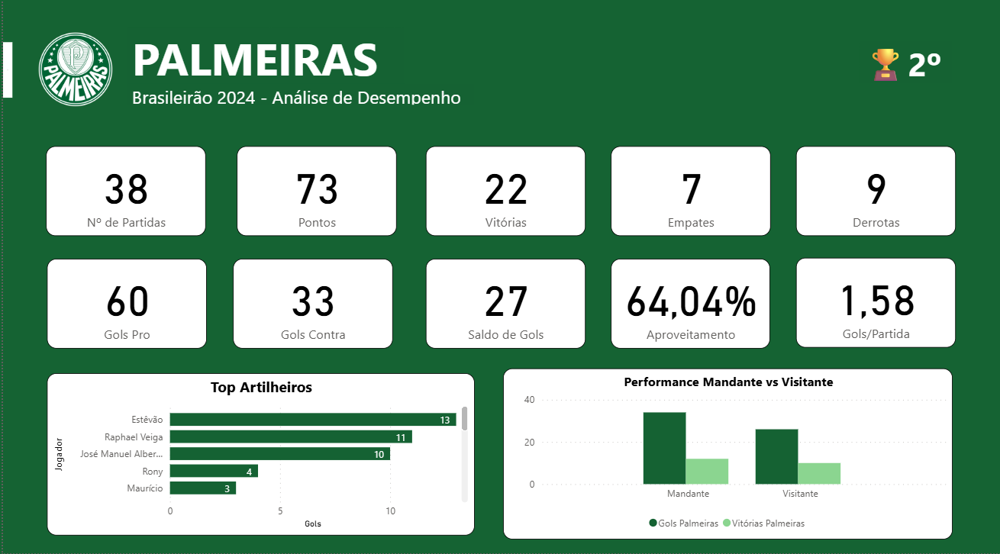

# Dashboard Palmeiras – Campeonato Brasileiro 2024

Este repositório contém um dashboard do Power BI com estatísticas do Palmeiras no Campeonato Brasileiro. O objetivo é analisar o desempenho do time em diferentes rodadas, destacando gols, vitórias, jogos como mandante e visitante, e os principais artilheiros.

---

## 📊 Imagem do Dashboard

> O print acima mostra o dashboard completo, incluindo gráficos de vitórias, gols marcados, gols sofridos, e ranking de artilheiros do Palmeiras.

---

## 🗂 Arquivos

- `pbix/` – Contém o arquivo do Power BI Desktop (`.pbix`) com todos os dados e relatórios.
- `imagens/` – Contém imagens exportadas do dashboard, incluindo prints e gráficos.

---

## ⚡ Métricas principais no dashboard

- **Gols do Palmeiras** – Soma total de gols marcados pelo time.  
- **Vitórias como mandante e visitante** – Mostra desempenho do time em casa e fora.  
- **Top artilheiros do Palmeiras** – Ranking dos jogadores com mais gols na temporada.

---

## 📝 Observações

- O dashboard foi feito com base nos datasets `campeonato-brasileiro-full` e `campeonato-brasileiro-gols`.  
- Para manter o dashboard atualizado, é necessário substituir os datasets pelos dados mais recentes do campeonato.
